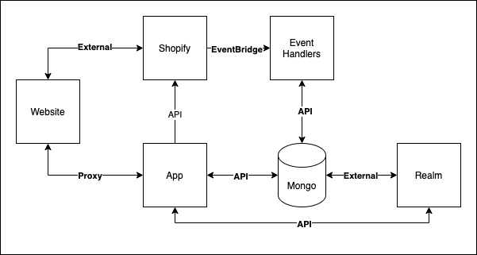

# Architecture

The date selector app utilises a number of services to perform its duties.

The app makes use of the following technologies:
- [Serverless framework](https://www.serverless.com/)
- [AWS Lambda / Lambda@Edge](https://docs.aws.amazon.com/lambda/index.html)
- [AWS CloudFront](https://docs.aws.amazon.com/cloudfront/index.html)
- [AWS CloudWatch](https://docs.aws.amazon.com/cloudwatch/index.html)
- [MongoDB](https://docs.mongodb.com/)
- [MongoDB Realm](https://docs.mongodb.com/realm/)
- [NextJS](https://nextjs.org/docs)
- [React](https://reactjs.org/docs/getting-started.html)
- [Shopify Polaris](https://polaris.shopify.com/components/get-started)

The majority of the AWS services are abstracted by the serverless framework.

## Data flow

Described below is the high level data flow of the application.

## AWS

The date selector apps sit with in an AWS organisation.

## Components

Component | Responsibility
--- | ---
Website | Responsible for serving the customer facing component of the date picker. I.e. the date picker popover. Each client has their own repository and implementation of this.
Shopify | Responsible for triggering events and housing the client facing application.
App | Responsible for a number of things. Providing a CRUD interface to the client to configure their application. Serving a proxy endpoint for the website component to retrieve availability from. Providing a carrier service endpoint [read more](https://shopify.dev/api/admin-rest/2021-07/resources/carrierservice). Handling calls from the realm function.
Mongo | Responsible for data storage.
Event Handlers | Responsible for handling events triggered by Shopify via event bridge and then normalising and mapping relevant data into Mongo. The code for this is in a [separate repository](date-selector-event-handlers)
Realm | Responsible for handling upsert triggers for the orders collection.

### Website
The website component refers the clients theme code. Each client has its own implementation which makes use of the date pickers app proxy to retrieve date availability from the `/lookup` api endpoint. The website will also retrieve shipping method availability from the `getShippingRates` end point, however the interface for this is handled by the Shopify carrier service.

### Shopify

n/a

### App

The app has 3 main areas of concern
- Provide an app proxy for the website to retrieve date availability from
- Provide an endpoint for the carrier integration to retrieve shipping rates from
- Provide an interface for the client to configure the business logic that the aggregations should work to

### Mongo

Stores all the application configuration as well as a soft reference to each of the Shopify orders.

### Event Handlers

Described in a separate repo [here](date-selector-event-handlers)

At high level, the event handlers simply handle order update, create and delete events triggered by Shopify via EventBridge. They then transform the order data and map it into a soft reference in our database to be further manipulated and aggregated upon.

### Realm

At present Realm is used for its trigger and cron capabilities. When orders are created/updated in the `orders` collection, a handler function will notify the app it needs to handle the order and transform its data (i.e. nominated dates, tags etc). The endpoints called are in the `/pages/api/realm` directory, you can see here what happens for each order create/update event.
